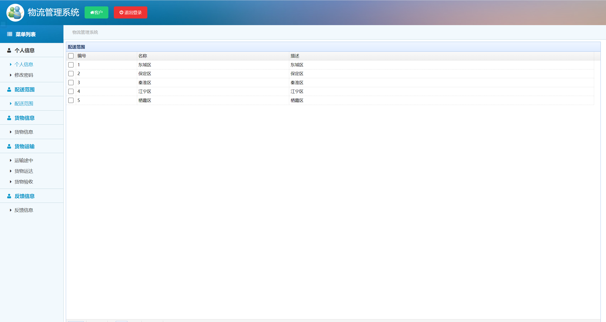

## 基于SSM的物流管理系统

- <b>完整代码获取地址：从戎源码网 ([https://armycodes.com/](https://armycodes.com/))</b>
- <b>技术探讨、资料分享，请加QQ群：692619798</b> 
- <b>作者微信：19941326836  QQ：952045282</b> 
- <b>承接计算机毕业设计、Java毕业设计、Python毕业设计、深度学习、机器学习</b>
- <b>选题+开题报告+任务书+程序定制+安装调试+论文+答辩ppt 一条龙服务</b>
- <b>所有选题地址 ([https://github.com/YuLin-Coder/AllProjectCatalog](https://github.com/YuLin-Coder/AllProjectCatalog)) </b>

## 项目介绍
基于SSM的物流管理系统，有客户、员工、管理员三个角色，主要功能如下

【客户】个人信息、配套范围、货物信息、货物运输、反馈信息
【员工】
客户管理：查看客户信息
反馈信息：回复反馈、反馈信息
基础信息：车辆信息、司机信息、配送范围
货物信息：审核货物
货物运输：运输途中、货物运达、货物验收

【管理员】
员工管理：员工信息增删改查
客户管理：客户信息增删改查
反馈信息：回复反馈、反馈信息
基础信息：车辆信息、司机信息、配送范围
货物信息：审核货物
货物运输：运输途中、货物运达、货物验收
统计信息：以图标的形式统计

## 项目技术
- 编程语言：Java
- 数据库：MySQL
- 前端技术：JSP、JavaScript、jquery
- 后端技术：Spring、SpringMVC、MyBatis

## 运行环境
- JDK版本：JDK1.8及以上
- 开发工具：IDEA、Ecplise、Myecplise都可以
- 数据库: MySQL5.7及以上

## 运行截图

